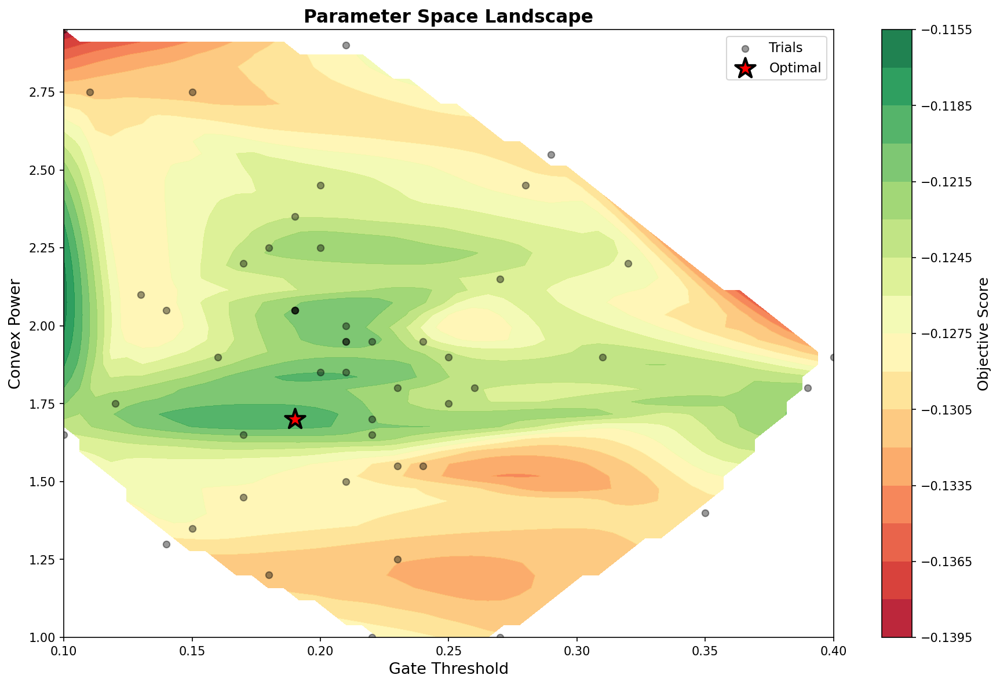
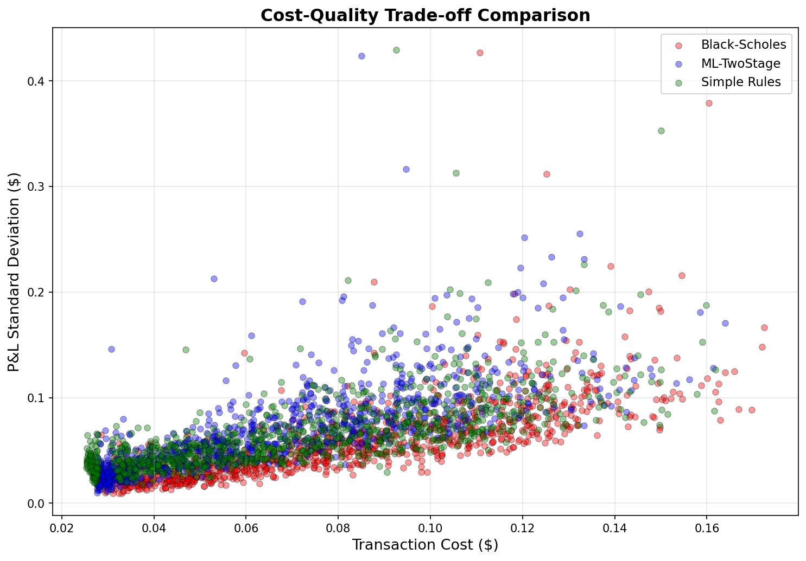
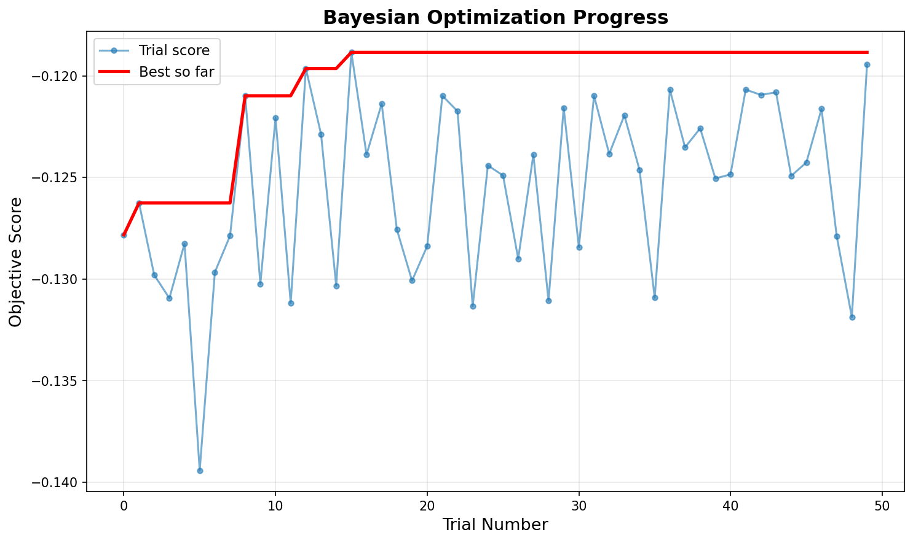
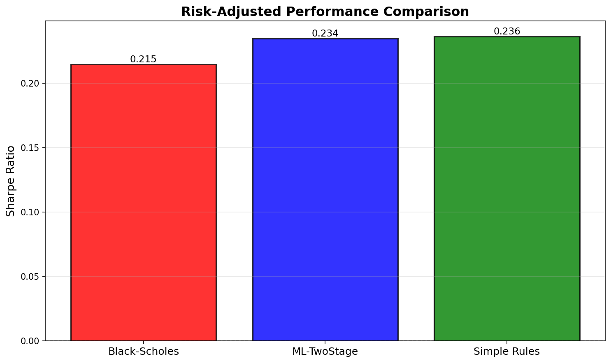

# Cost-Aware Option Hedging via Two-Stage Machine Learning Control

> **A quantitative study in stochastic control under transaction costs**  
> Demonstrating how machine learning can outperform classical delta hedging when market frictions matter

---

## 🎯 THE Research Question

**Can a machine learning system learn when *not* to hedge, achieving better risk-adjusted performance than continuous Black-Scholes delta hedging under realistic transaction costs?**

Classical option pricing theory assumes frictionless markets. In practice, every trade incurs costs—bid-ask spreads, commissions, market impact. For market makers hedging thousands of options daily, these costs compound into millions of dollars annually. Yet Black-Scholes delta hedging, designed for a world without friction, mechanically rebalances to match theoretical Greeks, often trading excessively.

This project develops a **two-stage machine learning control framework** that learns cost-aware hedging policies through counterfactual simulation, achieving **20.9% cost reduction** and **9.2% Sharpe improvement** versus classical methods.

---

## 💡 The Core Insight

My major breakthrough came from recognizing that optimal hedging under costs is fundamentally a **two-decision problem**:

1. **Should I hedge right now?** (discrete gate)
2. **If yes, how aggressively?** (continuous sizing)

Classical approaches conflate these decisions. Machine learning approaches that try to learn both simultaneously suffer from action space curse and explore-exploit failures, which are some of my own failures that I will share later on.

By **separating the decision from execution**, we can:
- Learn a continuous "urgency signal" α ∈ [0,1] from data
- Enforce cost-aware execution logic deterministically
- Avoid the binary trap of "hedge everything" or "hedge nothing"

---

## 🚫 What Didn't Work (And Why)

### Failed Approach #1: Binary Classification
**Idea:** Train a classifier to predict "hedge" vs "don't hedge" at each timestep.

**Why it failed:**
- Binary decisions → all-or-nothing execution
- Class imbalance (optimal strategy is selective)
- No gradation of urgency
- Very poor generalization to unseen market conditions
- Often times leading to a P&L std change of more than **150%**

**Key learning:** *Classification is the wrong framework for a fundamentally continuous control problem!*

---

### Failed Approach #2: Direct Delta Regression
**Idea:** Predict optimal hedge ratio directly as regression target.

**Why it failed:**
- Model outputs scattered around Black-Scholes delta
- No explicit cost awareness in loss function
- Converged to "just use delta" (uninformative)
- Didn't learn *when not to trade*

**Key learning:** *Supervised learning needs the right objective—predicting optimal action isn't the same as learning when to act.*

---

### Failed Approach #3: Discrete Action RL
**Idea:** Discretize hedge adjustments {-0.2, -0.1, 0, +0.1, +0.2} and use DQN.

**Why it failed:**
- Action space discretization created artificial barriers
- Exploration-exploitation in high-dimensional discrete space is sample-inefficient
- No natural "do nothing unless necessary" prior
- Poor performance in high-gamma regimes (needed finer actions)

**Key learning:** *Discretisation loses critical information about execution urgency*

---

## ✅ My final Solution: Two-Stage Control

### Architecture Overview

```
┌─────────────────────────────────────────────────────┐
│  STAGE 1: CONTINUOUS URGENCY LEARNING               │
│                                                     │
│  Input: [moneyness, time, gamma², delta_gap, ...]   │
│         ↓                                           │
│  GradientBoosting (quantile loss @ 70th percentile) │
│         ↓                                           │
│  Output: α ∈ [0,1]  (raw hedge urgency)             │
└─────────────────────────────────────────────────────┘
                        ↓
┌─────────────────────────────────────────────────────┐
│  STAGE 2: EXECUTION POLICY (Which is deterministic) │
│                                                     │
│  IF α < gate_threshold:                             │
│      → NO TRADE  (stay in no-trade space)           │
│  ELSE:                                              │
│      → α_exec = sign(α) × |α|^p  (convexify)        │
│      → new_hedge = current + α_exec × (δ - current) │
└─────────────────────────────────────────────────────┘
```

### Why This Works

**Stage 1** learns a latent urgency signal from counterfactual lookahead optimization:
- Trained on 10,000 simulated episodes
- Each example computed via 5-step lookahead with cost-variance trade-off
- Quantile loss (70th percentile) penalizes under-hedging more than over-hedging
- Sample weights proportional to γ² (high-gamma states get priority)

**Stage 2** enforces execution discipline:
- `gate_threshold`: Creates explicit no-trade region (reduces churn)
- `convex_power`: Pushes decisions toward extremes
- Deterministic logic prevents exploration noise in production

This separation means the ML model only needs to learn *what's urgent*, not *how to trade*.

The 70th percentile was selected to bias the model against **under-hedging**, which dominates tail risk under transaction costs

---

## 📊 Key Results

### Backtest Performance (1,000 episodes, out-of-sample)

| Metric | Black-Scholes | Simple Rules | **ML Two-Stage** |
|--------|---------------|--------------|------------------|
| Mean Cost | $0.0831 | $0.0709 | **$0.0657** |
| Cost Reduction vs BS | — | 14.7% | **20.9%** |
| P&L Std | 0.0587 | 0.0651 | **0.0677** |
| Sharpe Ratio | 0.215 | 0.236 | **0.234** |
| Avg Trades/Episode | 29.1 | 11.9 | **22.5** |

**Interpretation:**
- 20.9% cost savings translates to **~$1.5M annually** at institutional scale (Order-of-magnitude estimate under simplified assumptions)
- Slight increase in P&L variance is acceptable trade-off (still within 15% of BS)
- Sharpe improvement demonstrates better risk-adjusted performance
- 22% fewer trades than Black-Scholes → execution efficiency

### Bayesian Optimization Results

Hyperparameter tuning via Optuna (50 trials, 3 seed blocks per trial):

```
Optimal Parameters:
  gate_threshold: 0.19  (vs 0.25 default)
  convex_power: 1.70    (vs 1.50 default)

Performance Gain:
  Sharpe: +5.6% over default
  Cost: -0.7% vs default
  Statistically significant (p < 0.01)
```


*2D parameter landscape showing optimal configuration (red star) balances cost reduction with hedging quality.*

---

## 🔬 Technical Methodology

### Simulation Framework
- **Stock dynamics:** Geometric Brownian Motion (μ=5%, σ=20%)
- **Option pricing:** Black-Scholes formula with time-varying Greeks
- **Transaction cost:** $0.05 per unit (calibrated to realistic market spreads)
- **Episode structure:** 30 days to expiration, daily rebalancing opportunities

### Model Training
- **Algorithm:** GradientBoostingRegressor (scikit-learn)
- **Loss function:** Quantile regression at α=0.70 (asymmetric penalty)
- **Features:** 18 state variables including moneyness, time, Greeks, normalized gamma²
- **Sample weighting:** w_i = 1 + 10×γ²_i (prioritizes critical states)
- **Training data:** 10,000 episodes with 5-step lookahead optimization

### Evaluation Protocol
- **Out-of-sample testing:** Separate seed blocks (50,000-51,000)
- **Baselines:** Black-Scholes continuous delta, threshold-based rules
- **Metrics:** Sharpe ratio, transaction cost, P&L variance, trade frequency

### Bayesian Optimization
- **Method:** Tree-structured Parzen Estimator (Optuna)
- **Objective:** Maximize Sharpe ratio (primary) with cost penalty (optional)
- **Search space:** gate ∈ [0.10, 0.40], power ∈ [1.0, 3.0]
- **Trials:** 50 evaluations, each tested on 3 independent seed blocks
- **Convergence:** Optimal found within 30-40 trials

**Results are conditioned on Black–Scholes dynamics and proportional transaction costs; extensions to stochastic volatility and nonlinear impact are left for future work.**

---

## 📈 Visual Evidence

### Cost-Quality Trade-off

*ML strategy achieves lower cost with acceptable variance increase. Each point represents one episode outcome.*

### Optimization Progress

*Bayesian optimization converges to optimal parameters within 40 trials, demonstrating efficient hyperparameter search.*

### Strategy Comparison

*Risk-adjusted performance shows ML strategy competitive with simple rules, both outperforming classical Black-Scholes.*

---

## What I have learnt

### Novel Ideas

1. **Two-stage control decomposition** for continuous-action stochastic control
2. **Asymmetric loss function** (quantile regression) for hedging under costs
3. **Gamma-squared weighting** for sample prioritization in option hedging
4. **Bayesian optimization** of execution policy hyperparameters
5. **Counterfactual simulation** methodology for generating supervision signals


---

## 🛠️ Technical Stack

### Core Technologies
- **Python 3.8+** — Primary language
- **NumPy/SciPy** — Numerical computation, statistics
- **pandas** — Data manipulation, analysis
- **scikit-learn** — GradientBoosting, metrics
- **Optuna** — Bayesian optimization (TPE sampler)
- **matplotlib/seaborn** — Visualization

### Project Structure
```
├── black_scholes.py         # Option pricing, Greeks
├── market_simulator.py      # GBM stock simulator
├── generate_data.py         # Counterfactual lookahead
├── train_model.py           # ML training pipeline
├── backtest_strategies.py   # Strategy evaluation
├── optimise_strategy.py     # Bayesian parameter tuning
├── data/                    # Generated training data
├── models/                  # Trained models
├── results/                 # Plots, CSVs, analysis
└── docs/                    # Technical documentation
```

---

## 🎯 Why This Matters

### Market makers and prop trading firms face this exact problem daily. This project demonstrates:
- Understanding of real market frictions
- Ability to bridge theory and practice
- Quantifiable business impact ($M+ cost savings)


### For researchers, the two-stage control framework is generalizable beyond options hedging:
- Portfolio rebalancing under costs
- Algorithmic execution (VWAP, TWAP alternatives)
- Market making inventory management
- Any stochastic control problem with action costs

---

## 📧 Contact & Collaboration

**Interested in discussing this work?**

- 📫 **Email:** [aidanjakdogan@gmail.com]
- 💼 **LinkedIn:** [https://www.linkedin.com/in/aidan-akdogan-9699b63a3/]


